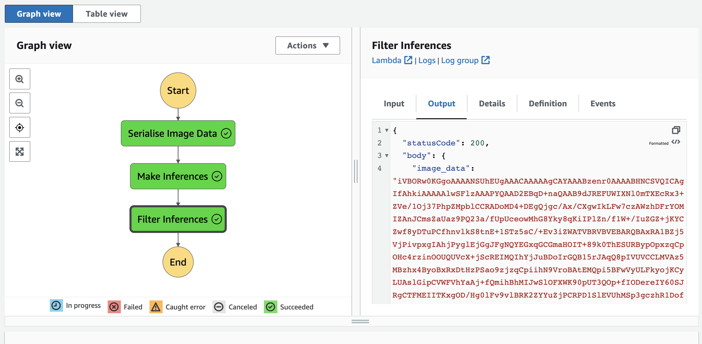
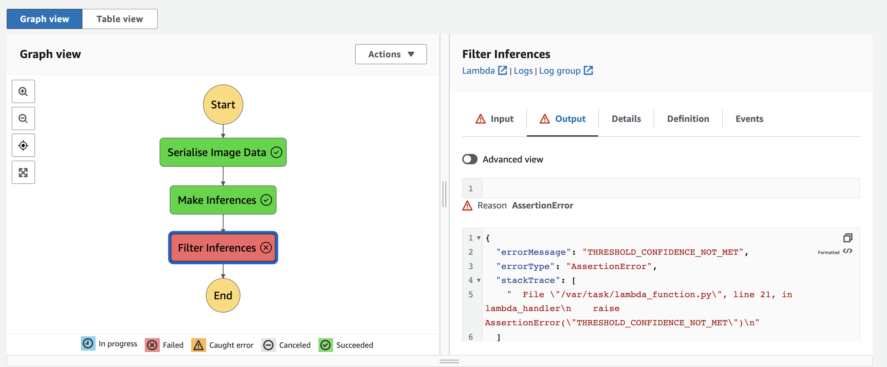
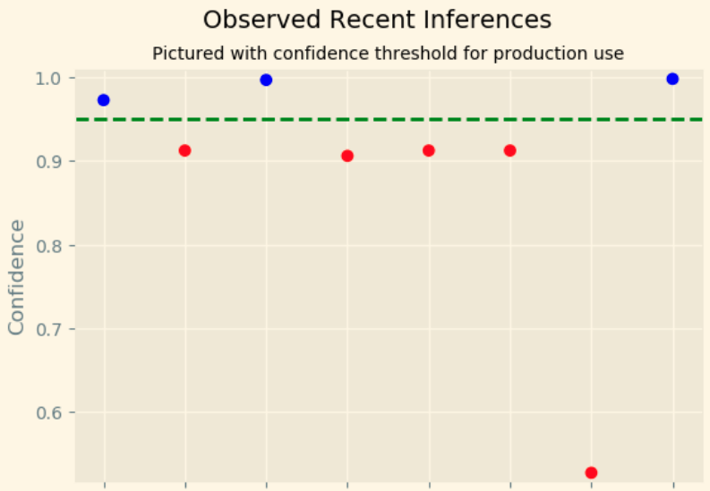

# AWS Sagemaker image classification and ML Workflow using Lambda and Step Functions

This project was completed as part of the Udacity AWS Machine Learning Engineering Nanodegree. To run the project, start an `ml.t3.medium` Sagemaker notebook instance and upload the scripts directory and `train_deploy_monitor.ipynb` to it. Then run `etl.py` and every cell in the notebook.

## Overview
The context was that we had been hired to build an ML Workflow for a delivery company that could be used to route delivery drivers to the correct loading bay and orders by way of training an ML image classifier that could detect what kind of vehicle the drivers had. In this way, workers on bicycles could be assigned to closer orders while motorcyclists could take the further ones, thus helping to optimize operations. 

The project consists of the following steps:

1. data staging,
2. model training and deployment,
3. Lambdas and Step Function workflow, and
4. testing and evaluation.

## Dataset
To train the model we used a subset of the <a href="https://www.cs.toronto.edu/~kriz/cifar.html" target="_blank" rel="noopener">CIFAR-100 dataset</a>, which is hosted by the University of Toronto (<a href="https://www.cs.toronto.edu/~kriz/learning-features-2009-TR.pdf" target="_blank" rel="noopener">Learning Multiple Layers of Features from Tiny Images</a>, Alex Krizhevsky, 2009). The dataset contains 100 classes containing 600 3x32x32 pixel colour images each. For details on data staging and processing, see `etl.py` and `data_prep.ipynb`.

## Results 
The model was trained using MXNet and produced a validation accuracy slightly over 81\%. While this could certainly be improved via data augmentation or increasing the size of the training set, as the main aim was to create a working ML pipeline this was satisfactory for the purposes of this project. 

### Lambda and Step Functions workflow
The model is then utilised in a Step Function workflow of three chained Lambda Functions that
1. serialise the image data;
2. call the model to make an inference;
3. check the result of the prediction against a pre-defined threshold and throw an error if this was not met. More specifically, the inference returns an array that indicates probability of class inclusion, and the threshold refers to the required level of confidence in the inference.

In this way, the workflow simulates a typical setup where the images are passed into the system for processing and inference, and the result (pass/fail) is passed onto another part of the system, either to downstream systems or erroring out for inferences below our confidence threshold. 

The screenshots below show the working Step Function in the two cases: the first where the Step Function succeeds at each Lambda and the second where it fails at the third and an error is thrown notifying that the threshold has not been met.

### Model monitoring
The deployment was configured to capture the results of inferences made by the endpoint. This has numerous practical benefits since in this way we record the predictions from the model and set them aside for further analysis, including, for example, as inputs for triggers indicating model deterioration. In the present case, we illustrate outputting a simple plot showing whether a recent stream of predictions occur above or below threshold. The threshold was relatively high, at 95\%, and, bearing in mind that our validation accuracy was \~80\%, we consequently have many  points (~60%) below threshold, i.e. many inferences where the system errors out due to low confidence. In reality, we would like to check not necessarily exactly how high the confidence is but also how many predictions are correct, since this is what has the real effect. For example, in the present case, if those inferences just below threshold turn out to be correct, it may indicate that the decision boundary is well defined but the threshold is simply set to high and should be reduced. 

